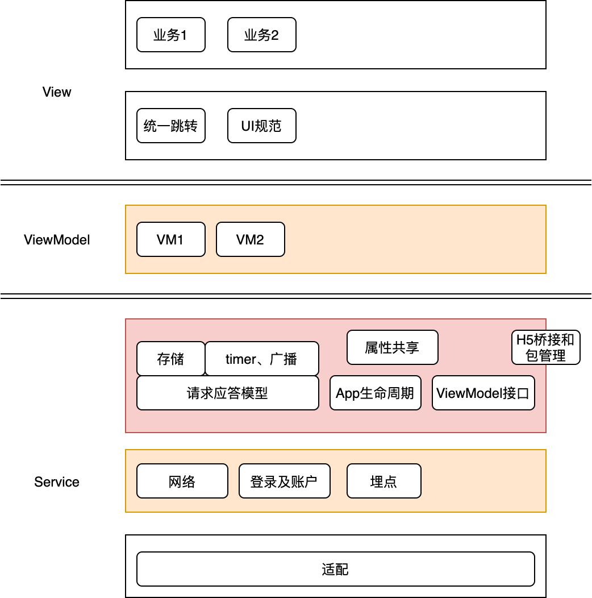
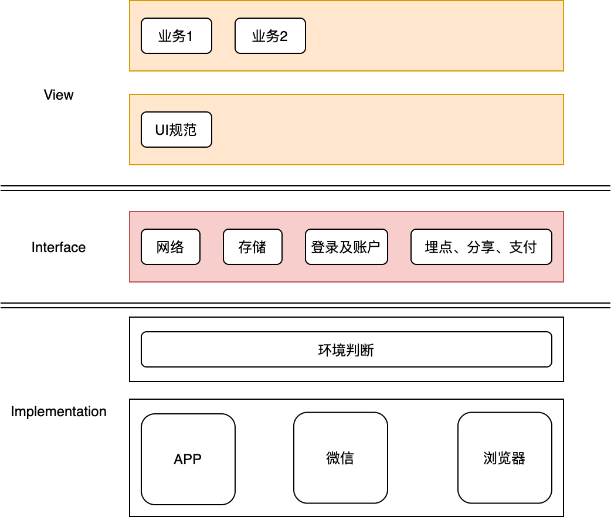

## 移动前端建设

#### 一、移动前端的角色
大部分应用型移动前端的角色就是一个后台服务的用户界面，用户通过这个用户界面来和后端服务交互，是用户和后端之间的一座桥梁。

目前主流需要覆盖的移动前端包含iOS、android、浏览器、微信公众号和小程序。


#### 二、开发成本和用户体验的平衡

2011年刚开始做iOS开发时，就是基于iOS系统库开发界面和功能，后来同学推荐用了Facebook的Three20，里面封装了一些控件和网络功能，印象比较深的是有上拉加载和下拉刷新。这时主要的还是基于系统做原生开发。原生开发用户体验是最好的，但是每端需要独立开发，成本较大。尤其是iOS开发，在相当长的一段时间内，中小公司很难招到合适的iOS开发人员。

后来phonegap慢慢火起来了，但一直没有用phonegap做个项目，觉得它太重了。在之后的项目中，需要web混合开发时，使用了自己简单的封装。虽然做到了三端复用，但是web页面的体验确实有问题，不适合体验要求高的场景。

再后来就出现了reactnative/weex等框架。很喜欢weex的哲学，一次编写覆盖iOS、android、浏览器三端。在尝试在项目中引入的时候，发现能力不够玩不转，只好放弃。最近腾讯开源的hippy看起来也不错，类似weex，还未尝试，不知深浅。这算是一个比较理想的平衡，但是门槛也比较高。

在后续项目中，体验要求高的部分我们采取了另一种模式，UI用原生开发，数据处理等逻辑共用。尽可能把非UI相关的代码，下沉到可在android、iOS复用的逻辑层。这种适合数据处理和逻辑相对复杂的场景，否则机制本身带来的额外工作量会抵消逻辑复用所节省的工作量。同一份逻辑代码也能较好的保障正确性。这对于原生App也是一个不错的平衡，但使用场景有限，大部分App没有太多逻辑处理。

Flutter建立了一种新的模式，在iOS和android里面建立一个子平台，基于这个新平台来开发，由平台抹平两端的差异。这彻底解决了原生App的开发成本和体验问题。但也有不确定性，开发语言群众基础不够，一般公司难招到合适的人，还有苹果对它的态度有不确定性。还有，一些非UI功能可能还是需要iOS、android平台单独实现。

一次开发，完美支持多端可能只是个无法实现的理想，就像追求长生不老一样。现实中，需要我们做各种权衡和选择，针对不同的场景在同一个APP里融合不同的模式，不断追求更高的效率和品质。


#### 三、基本架构
架构就是认知现实，明确各种事物以及他们的互相关系和利弊，结合事物自身的客观属性和规律，约定各个事物和谐共处的规则，即对现实的抽象。好的架构最基本的特征是复用和解耦。SOLID、DRY、KISS、YAGNI这几个原则在架构设计和具体编码层面都适用，根据这些原则来指导建立基本架构。

需要持续迭代更新的系统，首先要根据场景，选择适合的混合模式，来做到跨端级别的复用。最简单直接的方案就是原生+web。成熟稳定的功能或者体验要求高的功能用原生实现。变化的、非主要功能用web实现，覆盖所有端。web依赖于环境的接口要做抽象，以便适配各端。weex、reactnative、hippy、flutter都有一定门槛，当痛点足够痛的时候，再考虑引入这些框架。

然后，要处理好分层和模块化的问题，这个层面的解耦处理好了，迭代过程中整个工程就不会乱。分层是一种横向的划分，要定义清楚每层的职责范围和层之间的交互规则。模块化是一种纵向的划分，主要是规范基于公共基础平台之上的各个上层业务模块，业务模块之间高度解耦，互不影响，通过统一的接口交互。这样横纵一切分，基本的骨架就有了，每层每块都比较独立了，能比较好的应对各种变更需求，能比较好的去对每层或每个模块单独重构而不会牵一发动全身。

前端大部分代码在处理UI的呈现和交互，UI一定要有规范，否则随着迭代的进行和团队的扩张，会越来越乱。UI规范要阐明和设计团队一起定义的基础样式，按范围可以分为全局、模块、页面级别的样式，按种类分为颜色、字体字号、大小边距等。如果未来可能有换肤需求，应该提前设计好。规范还要明确公共控件，形成控件库。把这些东西实现成基础设施，让上层业务开发人员能快速开发页面。这样能保证全局风格一致，新人加入时能快速上手，能比较好的应对未来的UI变更需求。

还有，需要对网络访问、存储、缓存、埋点等基础功能进行抽象封装，UI层调用自定义的API，不依赖于具体的实现，方便替换具体实现。

最后，对账户系统等全局基础性业务功能，进行封装，方便其他各个业务系统调用。账户系统几乎是每个模块都会用到的，一定要设计好，账户不顺，业务功能也不会顺。

有了这些基础设施之后，就可以基于此来快速开发各个业务模块了。

#### 四、实战经验

##### 1、项目背景
我们所建设的项目特点是业务功能非常繁重，主业务功能对体验、稳定性要求非常苛刻，运营类业务功能变化非常快。

所以主业务部分，我们采用原生UI+共享逻辑的方式，这样既保证了用户体验，又强制把UI和较为复杂的逻辑分离，只用保障一份逻辑代码的正确性和稳定性要容易很多，成本降低了很多。而且往后对UI的优化重构，也不用担心影响到业务逻辑的正确性，甚至能基于逻辑代码，能快速开发多套UI。UI使用每个原生平台API来开发，应该是质量最高的。除了UI交互的部分，尽可能下沉到公共逻辑部分，提高复用率。UI和逻辑做了比较明确的划分，也能比较好的实现分工和并行开发，缩短大型项目的工期。


运营类功能属于尝试、创新类，不影响主业务功能，需要快速响应灵活多变的需求，尽可能的覆盖更多的端。我们采web的方式来覆盖App、浏览器、微信端。

##### 2、原生APP



图中粉红色的部分是项目无关的一些跨两端可复用的服务或机制。黄色部分是项目相关的跨两端可复用的逻辑代码，主要是ViewModel和一些项目相关的全局服务。白色背景的是平台相关的原生代码，主要是页面和交互。

###### a、项目无关的一些机制
android和iOS共享逻辑，可以采用RPC或者直接方法调用。RPC对语言的要求更少，只要两个平台能运行就行，比如JavaScript、python等脚本，或者golang、c++等能跨平台的编译语言，RPC会有少量的性能损耗。直接方法调用要求逻辑代码要能编译成两个平台都能调用的库，例如c++(jni)，或者使用像j2objc这样的工具把java转成objective-c。

我们引入的是j2objc工具，能够用java se实现的逻辑，都下沉到共享逻辑层，然后通过工具转换成objective-c，给iOS平台使用。

共享逻辑层里面，我们模拟了MVVM模式，规定了原生View和共享逻辑的交互接口，但是没有实现自动绑定，都是通过手动调用。View层只处理平台展示和交互，获取数据和操作数据都是ViewModel层处理，ViewModel层是两个平台复用的，所以逻辑越复杂，这种模式效果越好。View和ViewModel的接口定义如下：

```
public interface ViewModelInterface {
    //int refreshData();
    void setView(ViewInterface view);
    void cancel();
}

public interface ViewInterface {
    void mvvmRefreshFinished(int serial, boolean isSucceed);

    void mvvmShowLoading();

    void mvvmHideLoading();

    void mvvmShowHud(String msg);

    void mvvmShowAlert(String title, String msg);

}
```
View会持有一个或多个ViewModel，需要刷新数据或者操作数据时，调用ViewModel的相应方法，如refreshData，异步方法会返回一个序列号，ViewModel处理完成后，会调用View的mvvmRefreshFinished告知结果。通过这种固定的模式来交互。一些View常用功能也可以定义在View接口中，这样ViewModel需要View做这些常用操作时不用切换，直接调用相应方法，这样方便在ViewModel中沉淀更多逻辑。ViewModel也可以持有其他ViewModel，自己同时实现两种接口，给其他ViewModel充当View代理，这样方便模块化ViewModel，通过各个小模块最终组合成一个大的ViewModel给View提供服务。

为了让更多代码下沉到共享逻辑部分，View应该只处理UI交互，其他所有事情都交给ViewModel，网络请求、存储、状态管理等。但是ViewModel又有一些限制，有些功能只能用原生代码或者用原生代码实现更好，为了减少执行切换的交互，抽象了一个请求应答模型，把一切自己不能实现的功能包装成一个请求，让真正的执行者去完成这个请求并返回结果。这样很多主控逻辑都能写在ViewModel里，遇到自己不能实现的，就调用View或者包装成请求，交给执行者执行请求，然后处理结果。配合请求应答模型的，还有一个请求队列管理和全局的执行者管理。队列负责管理请求并发、暂停、恢复，执行者管理接受注册和分发请求。利用这个模型，也能处理H5和原生的交互。甚至，能把切换到主线程包装成一个请求，让原生平台在主线程中回调ViewModel。当然，为了简单和不出错，ViewModel中尽量不要新开线程，就相当于一个函数静态库，被View调用，只运行在调用线程中。

ViewModel中请求网络的一个样例如下：
```
public int refreshData() {
        int serial = getNextSerial();
        
        //构建request
       
        //AsyncExecutor是全局异步请求执行者管理器，接受任何类型的请求，然后根据执行者注册信息分发给具体执行者。
        AsyncExecutor.executeRequest(request, new AppCallback<AppResponse>() {
            @Override
            public void onComplete(AppRequest req, AppResponse resp) {
                if (resp.errNO < 0) {
                    mvvmShowAlert(resp.errMsg);
                    mvvmRefreshFinished(serial, false);
                } else {

                    //处理数据，View后续需要数据时，调用单独的方法获取数据，不通过mvvmRefreshFinished直接返回数据，让数据处理和管理留在ViewModel中。
                    
                    mvvmRefreshFinished(serial, true);
                }
            }
        }, this);
        return serial;
    }
```
基于这个模型，ViewModel中具备了调用网络、存储、发送广播的能力，能承载更多的主控逻辑，虽然真实的功能是有平台自己建立执行者去适配的。

web调用原生功能时，也用到请求应答模型。每个webview定义了一个唯一pageID并暴露给web，webview会把相应的服务名和pageID拼接在一起注册到全局执行者管理器。web只用管发送请求给原生，原生把请求传给全局执行者管理器，再分发给相应执行者。如果请求不带pageID，就会分发到一些全局的服务，例如利用原生的网络访问、持久存储。如果请求携带当前页面pageID，则会分发到当前页面的服务，例如配置当前页面导航栏或其他一些样式设置。如果请求携带其他web页面的pageID，就能实现多个web页面的交互。

一些服务可能需要根据APP的生命周期来做一些操作，服务需要实现生命周期接口，然后把服务注册到APP生命周期管理器，管理器在相应时机逐个 调用服务对象的方法。

###### b、项目相关的一些基础设施

上面的请求应答模型只是一个模式，真正的网络请求实现是项目相关的，需要新建请求应答类，并且实现、注册执行者。ViewModel发送网络请求后，全局执行者管理器会把这类请求分发给真实的执行者去完成真正的网络请求并返回结果给ViewModel。

账户及登录几乎是所有系统都需要的模块，上层的每个业务模块也几乎都会用到，所以一定要做好抽象，提供合理的接口给ViewModel或View。只有把账户、登录或者相应的权限理顺了，开发其他业务功能才能顺畅。

像埋点这样的功能，可以自己定义一套API，然后在实现里面去适配埋点平台，防止更换平台。把埋点暴露成服务，让原生和web都能方便使用。对于所有的活动信息，用户的操作、客户端的异常和性能，最好都尽可能自动的、更多的埋上点，方便后期分析运营，让前端的活动能够可视化。

###### c、View层
前端80%的代码都在处理UI和交互，对于稍大的项目，如果没有规则，随着需求和迭代的增加，项目会越来越乱，到后面是牵一发动全身，完全不想去做任何修改。对于持续迭代的项目，首先要做的是模块化，把业务拆成一个个小的独立的模块，模块能独立开发编译。模块化后需要解决模块间的交互问题，我们引入了统一跳转。按照protocol://hostname/path/?query的格式，定义出需要暴露的页面或功能，其他模块需要跳转时，就打开这个url。这些定义是两端统一的，不仅用于原生模块间的跳转，web和外部系统也能跳转，当然要做权限控制防止被恶意调用。有了统一跳转，每个模块不会显式依赖了，而是依赖这份全局的跳转定义，对于不支持或不认识的跳转定义，可以提示去升级APP。后续的运营web页面，也能方便的跳转暴露的原生功能页面。

另外，为了防止View层代码混乱和样式不统一，以及未来可能的变更需求，可以制定一些UI规范。按照作用范围可以分为全局、模块级别、页面级别的规范，按照元素可以分为颜色、字体字号、图片引用规范。全局的规范一定要执行好，否则APP做出来五颜六色的。颜色和字体字号的种类应该是比较固定的，把这些值定义成常量，代码中引用这些常量，这样以后优化、换肤之类的，可能通过修改定义就能实现了，而不用每个页面去修改。

###### d、j2objc的使用
[j2objc](https://developers.google.com/j2objc/)是Google推出的一个工具，用于把Java客户端逻辑代码转换成Objective-C代码，来实现android和iOS共用一份逻辑代码。甚至可以借助GWT实现三端共享逻辑。由于它只能处理非UI代码，所以只有当APP的逻辑足够复杂的时候作用才会比较明显，否则反而会降低开发速度。虽然说是‘beta quality’，但我们试用过程中没有遇到任何bug，而且项目也在持续更新，Google出品，还是值得信赖。

我们把共享代码放入单独的工程，通过maven来管理依赖，把源代码和编译后的jar包上传到私有maven仓库。安卓直接引用编译后的jar包。iOS新建一个工程，把所有共享代码包先拉取下来，然后统一转换成Objective-C，然后再编译成framework。我们没有部署私有cocoapod仓库，所以再把编译好的framework上传到maven。其他iOS工程需要引用framework时，先通过maven把framework下载到工程目录，然后通过cocoapod安装framework。

j2objc有相应的maven插件（j2objc-maven-plugin），通过脚本，整个构建过程也比较方便。

iOS共享工程的run script参考：
```
rm -rf ${SRCROOT}/java

#下载所有依赖，每个依赖包就是一个共享代码库源码
mvn -X -U dependency:unpack-dependencies;

#执行j2objc把所有java代码转换成objective-c代码
mvn -X -U j2objc:convert -Dj2objcroot=${J2OBJC_HOME}

#把所有头文件汇总到一个头文件，其他ios工程都只引用这个汇总的头文件
rm ${SRCROOT}/iosvm.h
echo "#import <UIKit/UIKit.h>">>${SRCROOT}/iosvm.h
echo "">>${SRCROOT}/iosvm.h
echo "FOUNDATION_EXPORT double iosvmVersionNumber;">>${SRCROOT}/iosvm.h
echo "FOUNDATION_EXPORT const unsigned char iosvmVersionString[];">>${SRCROOT}/iosvm.h
echo "">>${SRCROOT}/iosvm.h

cd iosvm

for n in `find * -name "*.h"`; do

echo "#import \"${n}\"" >> ${SRCROOT}/iosvm.h

done

```

##### 3、web


我们有一个web项目模板，独立的需求我们都会根据模板新建一个项目，模板中包含了一些基础设施。最开始web只支持运行在APP中，跟原生APP耦合很紧，网络请求都是走的原生APP的TCP通道，导致适配微信和浏览器时，工作量有点大。我们希望对业务开发屏蔽平台特性，抽象了一个平台相关的接口层，业务开发只用熟悉UI规范和接口层，就能开发出天然适配各个平台的业务代码。依赖平台的操作都抽象成接口，在运行时判断web的运行环境，调用每个平台的实现。由基础设施抹平了平台环境的差异。

a、APP端的适配

原生APP会给web注入一个bridge对象和一个pageID对象。pageID用于标识当前页面。bridge实现原生和web的通信。

web端实现了三个接口：
```
//用于向原生发送通知并接受结果执行回调，其实就是调用原生bridge的handleNotification方法
postNotification(name, param, callback)

//原生调用postNotification时其实是调用web的handleNotification，web会根据name查找注册过的处理函数。
registerHandler(name, handler)
handleNotification(name, paramStr)
```

原生bridge端对应的有两个接口：
```
handleNotification(name, paramJsonStr, callbackNameStr)

postNotification(name, param)//单向Native调用JS，暂不支持回调
```

原生端接受到通知后，会包装成请求交给全局执行者管理器来分发，无缝的使用原生既有的功能。

#### 五、总结
前端也是一套系统，也有相应的架构。架构是随着业务的发展逐步进化而来的。要准备足够多的工具或方案，针对各种场景选择适合的工具或方案。在进化的过程中，把一些基础设施（像模块化、自动化埋点等）当成开源库来开发，而不只是为了实现基本的需求效果，这对团队能力提升会有非常大的帮助。
