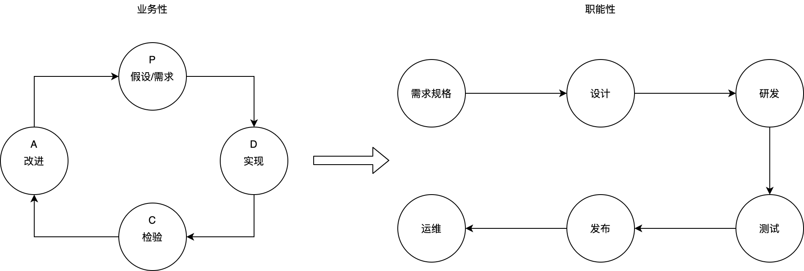

# 企业IT架构

### IT的定位
管理中，一般会把企业分成业务部门和职能部门。业务部门就是承担经营业绩，实现业务目标、创造利润的部门。随着业务线条的增多，业务部门也可能越来越多。为了让各业务部门能够更敏捷，把一些共用的基础职能抽离出来，形成专业的职能部门，为各个业务部门统一提供服务。比如财务、法务、IT等职能，都是需要一定的专业技能，每个业务部门自己去承担这些职能，不利于提升专业度，也不利于统一的管控。
IT部门是一种职能部门，为业务部门提供IT支持，协助他们达成业务目标。即便是在有强大基础设施支撑的情况下，IT前置到业务部门，IT还是处于支持的角色，只是业务闭环中技术实现的步骤。

### IT架构

在非技术研究型机构，很少讨论信息科技本身，而主要是讨论信息科技的应用，如何让技术和业务深度融合发生强烈反应，进而促进业务或者革新业务。技术的直接表现形式就是一个个承载业务流程的信息系统。技术的价值是通过业务价值来体现，是否真正给业务带来了降本增效，是否真正创造了新业务，投入产出比不合理的事情不长久。技术和业务的融合程度，可以是系统参与业务流程的某一环节，或者是参与所有环节，或者是驱动整个业务流程。要达到最优的融合，需要对技术和业务都有非常深入的认知和理解。

我理解的架构是，找出事物的所有要素以及要素之间的关系，然后分析抽象出的一般性结构定义和交互规范。这其中包含了架构的方法和结果。架构的方法是，先列出所有要素，理清要素之间的关系，然后进行分析和抽象。架构的结果是囊括所有要素的结构定义，以及各个结构之间交互的规范。这些结构定义和交互规范的主要作用是为了让事物结构更清晰，交互更顺畅，进而更好的应对未来的变化。不变的事物不需要架构。当要素或者要素之间的关系发生变化时，能够根据这些定义和规范迅速应对，不让事物越来越乱而失去控制。当这些定义和规范不能很好的应对变化时，就需要重复架构的方法来改进架构。例如，在一个很小的刚起步的研发团队里面，没有太明确的组织架构，大家都能很好的沟通协作。随着团队的扩张发展，沟通管理成本逐步变大，就需要抽象出团队的组织架构让团队更有效率的协作。组织架构的所有要素就是团队成员和成员之间的关系。分析抽象这些成员和关系的维度可以是多样化的，可以按照成员的专业属性来抽象，也可以按照所参与的业务来抽象，进而得出不同的组织架构。随着团队的不断扩张，组织架构也会不断进化。

所以，我理解的第一层IT架构就是，分析公司所有业务流程，抽象成合理的信息系统结构定义和交互规范。当然，这是最粗粒度的IT架构，但也是和业务最直接相关的。业务关心的是所有业务流程的创建、变更、开展，都有信息系统承接，都能迅速响应变更，都能提供更好的辅助功能帮助业务提升业务效果。这层架构是非常重要的，因为单个系统内部不管用多好的技术都没办法解决这一层面的架构问题。而这一层也往往容易被忽略，大家更乐于迅速敲定需求，而一头钻进技术实现里面去。对于跨系统、跨业务线条的，也很容易出现管理真空，大家都不想管，不想去抽象，只对自己负责的地方负责，不会站在全公司层面思考。

大公司业务纷繁复杂。相对标准的业务，一般都有第三方公司进行抽象实现，可以直接采购相应系统。个性化的业务，自研信息系统来支持更好，能更持续、更快速的响应业务变更，能提升差异化竞争力。在采购或研发系统之前，应该先设计好系统的定位和系统边界，从全公司业务层面考虑系统复用。采购的系统可能来自不同的开发商，每家系统的内部技术架构完全不一样。这样会带来系统之间交互困难的问题。这些系统的维护和扩展也成问题。所以这层架构还应该制定基础的功能和数据交互规范，扩展规范，监控规范等，让每个系统都变得可交互、可维护、可扩展。简单举例，从人员角度分析，有人的地方就要有账户，账户系统是最基础的业务系统。但是每家系统的账户系统不一致，所以抽象出了统一账户系统。人之间要发生往来，需要有相应的通道，所以还能抽象出覆盖所有人员的IM和消息推送系统。为了更好的推动一些工作，全局的流程和任务系统也很有必要。为了更低成本、更好的服务客户，高复用的各种客户端系统也很必要。这些系统可能来自不同开发商或者自研，我们可以制定统一的单点登录规范，所有系统的账户和登录，必须使用统一的账户和登录信息，不同账户的系统之间很难打通交互。我们可以建设统一的服务注册和发现规范，所有的系统都按照这个规范来适配暴露自己的公共接口，这样每个系统之间都能互相调用，屏蔽了系统内部差异，也可以根据每个系统暴露的接口来做一些功能扩展。当然也不能无序调用，还要定义调用的规则。还可以定义系统的数据暴露规范，让数据聚合更方便。还可以定义统一的监控规范，每个系统的关键事件必须对接到统一的监控平台，方便统一监控和维护。还可以定义统一的定时运维任务接口，方便日常管理。

各个系统内部，又都有自己内部的结构和规范。对于采购的系统，很难约束到他们的内部架构。对于联合开发的系统，成熟的插件机制必不可少，否则联合开发太痛苦了，但是开发商设计系统时，一般都没有一个开放成熟的插件机制，最终会变成采购或者自研。例如WordPress内容管理系统，通过开发不同的插件，能把它变成各种用途的系统，门户、电商等。对于自研的系统，可以按技术领域抽象成不同的类型，比如客户端系统，中后台系统，大数据系统等。同类型的每个系统之间会共享很多基础设施，要把能抽象的都抽象出来复用，每个系统有差异化的是业务逻辑。可以把这些基础设施封装成基础平台，业务开发只能基于这个平台开发业务插件，这样就能很好的管控业务开发，也能很好的防止重复造轮子，提升复用性和可维护性。例如前端系统，网络请求、本地存储和缓存、账户登录、分享支付、埋点这些都是通用服务，把这些服务就是基础平台，平台上可以开发各种业务。

系统的运行还依赖于其他一些要素，硬件、网络等，这些要素也可以抽象出合理的结构和规范。

总之，IT架构就是按照一定的原则，按不同层次抽象出来的结构和规范。任何事情来了之后，都能融进这些结构和规范里面，不会乱。最核心的两个层次就是，针对业务的分析和抽象，以便规划合理的系统；针对每个研发领域的技术分析和抽象，以便形成技术基础设施。

### 架构原则
架构的目的是让IT体系更有效率和质量。一些编程思想或原则可以用来指导架构，例如高内聚低耦合、高复用、可维护、DRY、KISS、DFF、SOLID。
除了坚持这些思想和原则，我想再多加两点：可管控、智能化。

可管控有点类似可维护，但重点在可管理性和可控性。可管理性就是任何要素都能被管理，所有要素都有自己的清单和记录。可控性就是任何不被允许的都要通过各种办法强制禁止，没被禁止的就是默认允许的。在水平较高的团队里，或者团队成员较少的时候，各种规范通过引导就能很好的执行。但是成员较多或者团队没有那么强的时候，规范的执行就只用可控的强制办法推行。

智能化就是改变人在业务流程中的角色，让人承担更少的职责，让系统承担更多的职责。

### 信息安全
信息安全的重要性日益突出，是IT体系中一个很重要的要素。
信息安全是一个很专业的问题，不能依赖于一个普通群体来达到信息安全。很难让一个群体都具备比较专业的信息安全专业知识，也不能太依靠群体的安全意识。让一个群体具备同一个意识，或让群体主动按照同一个准则行事，是非常困难的。群体大了以后几乎不可能主动达成一致性，总有人会出现例外。但信息安全问题不允许例外，所以信息安全应该采取强制白名单原则，即允许的都是被认为安全的，否则就应该禁止，不能把决定权交给群体。除非技术手段无法做到彻底禁止，才能降级依赖于群体的安全意识。信息安全一定要可管控，它也适用木桶短板原理。只要有一个地方没有管控住，那么其他地方巨大的投入都会化为泡影，起不了作用。

### 系统研发
通用业务采购成熟的产品是更好的选择。个性化创新业务自己研发系统是更好的选择。这样能快速尝试和实施创新业务，保持差异化竞争力。系统研发不是一锤子买卖，不要幻想依赖外部力量来满足自己的个性化需求。对外部力量来说，他们一般服务不止一家甲方，他们很难保证在个性化需求上投入足够的资源。开发好了个性化需求，他们也不能直接卖给其他甲方，对他们来说价值不大。他们也就不会考虑太多质量问题，反正做出来验收了就行了。这样做出来的产品，必然没有质量和可维护性。如果以后需求有变动，对双方来说都是一件成本很高很痛苦的一件事。

系统研发有必要，但是又不能陷进系统研发。在研发之前，要拟定好业务假设或目标，不能把系统研发本身当成业务目标。系统研发只是业务目标中的技术实现步骤，即便是售卖系统本身，系统研发也不是业务目标。还要评估投入产出比，潜在业务价值不能覆盖系统研发成本，那这就是一笔亏损的生意，即便业务运转起来了，也不会有持久的生命力。

系统研发的可管控性体现在，把系统拆成原子业务模块，每个模块相对独立，能独立修改发布，互相的影响降到最低。用搭积木的方式做系统，有统一的交互接口，只依赖于接口，某块积木坏了能单独拆出来维修或替换，对整体没有影响。

系统研发的智能化体现在，业务需求开发人员能够基于一定的基础设施快速的实现这个原子业务模块，实现完成后能迅速投产。我们现在的开发，更多的是面向操作系统编程，有很多基础工作需要处理。我们需要构建自己的基础设施，让业务开发变成面向特定平台开发，这样效率和质量会有很大提升。例如，与其从0开发一个商城系统，不如直接基于一个成熟的CMS系统开发相应的插件，后者在效率和质量方面会更好，前提是对CMS平台很熟悉。这样严格区分基础平台研发和业务研发，可以更有效的利用外部先进平台，来为业务研发服务。也有利于把自身的技术优势输出，形成额外价值。

